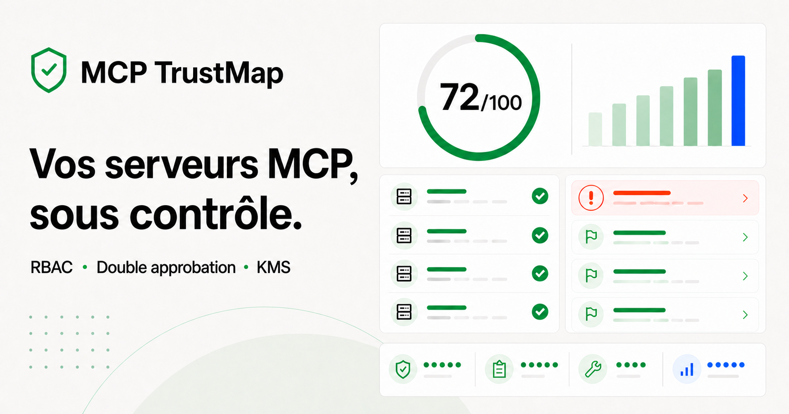

# MCP TrustMap

[](https://github.com/mawoole/SecureMPC/actions/workflows/ci.yml)



MCP TrustMap est une application web d’audit de configurations MCP
([Model Context Protocol](https://modelcontextprotocol.io/)). Elle transforme un
inventaire de serveurs difficile à relire en une posture de sécurité claire :
score global, risques prioritaires, explication de l’impact et correctifs
directement applicables.

## Modules produit

- **TrustMap Discover** construit la cartographie des serveurs, sources,
  transports et composants découverts par le collecteur local ou par import.
- **TrustMap Audit** applique le référentiel de sécurité, priorise les écarts,
  fournit les correctifs, gère les exceptions et conserve l’historique agrégé.
- **TrustMap CI** simule une politique sur l’inventaire courant et génère la
  commande ainsi qu’un workflow GitHub Actions multi-environnements, avec
  chemins, seuils, SARIF, CycloneDX, OSV et provenance configurables par profil.
- **TrustMap Enterprise** mesure la couverture des propriétaires et des preuves,
  présente la posture par équipe et exporte un pack de gouvernance JSON.

Les vues Enterprise reflètent uniquement les données réellement chargées.
L’interface ne simule pas de SSO, de synchronisation multi-utilisateurs ni de
connexion à un annuaire d’entreprise.

> Le moteur actuel réalise une **analyse statique locale** des configurations.
> Il ne remplace pas un test d’intrusion, une revue des permissions réellement
> accordées ni une surveillance d’exécution.

## Fonctionnalités

- import d’un fichier JSON ou collage direct d’une configuration ;
- collecteur local multiplateforme pour inventorier les configurations connues ;
- découverte de Claude Desktop, Cursor, VS Code, Windsurf et des workspaces ;
- masquage des secrets avant la création de l’inventaire ;
- vérification MCP passive et optionnelle des endpoints HTTPS ;
- affichage de la version négociée et des capacités annoncées ;
- inventaire des composants npm, PyPI, OCI et exécutables locaux ;
- détection des tags d’images mutables et dépendances non verrouillées ;
- résolution des dépendances transitives depuis les lockfiles npm, pnpm, Yarn,
  uv et Poetry ;
- découverte bornée des packages npm/pnpm/Yarn d’un monorepo ;
- vérification cryptographique des signatures npm et des attestations SLSA
  avec Sigstore ;
- vérification des signatures Cosign et des attestations SLSA d’images OCI
  verrouillées par digest, avec plusieurs politiques sélectionnées par préfixe ;
- génération hors ligne de politiques d’admission Kubernetes Sigstore à partir
  des mêmes identités OCI ;
- validation CI déterministe des bundles Kubernetes générés ;
- contrôle CI des configurations avec seuil de sévérité et export SARIF ;
- recherche optionnelle des vulnérabilités connues via OSV.dev ;
- prise en charge des objets JSON `mcpServers` utilisés par Claude Desktop,
  Claude Code, Cursor et VS Code, ainsi que des tables TOML `mcp_servers` de
  Codex ;
- détection locale des secrets présents en clair ;
- contrôle du chiffrement des transports distants ;
- détection des shells intermédiaires et options dangereuses ;
- signalement des dépendances non verrouillées ;
- contrôle des chemins de fichiers trop larges ;
- vérification du principe de moindre privilège ;
- score de sécurité global et par serveur ;
- priorisation par criticité ;
- remédiations expliquées avec extraits de configuration copiables ;
- historique persistant des scores et écarts, comparé audit par audit ;
- export CSV chronologique de la posture et des écarts agrégés ;
- exceptions de risque motivées, attribuées, datées et révocables ;
- export de rapports PDF, JSON, SARIF et d’un SBOM CycloneDX 1.7 ;
- vues dédiées aux serveurs, règles et audits ;
- interface responsive et accessible au clavier.

## Confidentialité

L’analyse statique est effectuée dans le navigateur. La découverte est effectuée
par un collecteur local explicite :

- aucune configuration importée n’est envoyée à un service distant ;
- les valeurs sensibles détectées ne sont jamais affichées ;
- aucun secret n’est enregistré dans le stockage du navigateur ;
- le registre d’exceptions reste sur l’appareil dans le stockage du navigateur ;
- l’historique distant conserve uniquement des compteurs agrégés par règle,
  associés à un identifiant utilisateur pseudonymisé ;
- aucun nom de serveur, chemin, configuration, extrait de correction ou secret
  n’est envoyé avec cet historique ;
- le rapport PDF est composé et téléchargé localement, sans envoi du contenu ;
- les secrets concrets sont remplacés par `${REDACTED}` avant l’écriture de
  l’inventaire ;
- le collecteur ne lance jamais les commandes des serveurs `stdio` ;
- les lockfiles sont lus comme des données : npm, pnpm, Yarn, uv et Poetry ne
  sont jamais exécutés ;
- le probe n’envoie jamais les en-têtes d’authentification trouvés dans les
  configurations ;
- le probe ne contacte que les endpoints HTTPS et n’appelle aucun outil MCP ;
- l’analyse OSV est désactivée par défaut ; avec `--osv`, seuls les PURL des
  composants ayant une version exacte sont envoyés à `api.osv.dev` ;
- aucun chemin, configuration, en-tête ou secret n’est envoyé à OSV ;
- la vérification `--provenance` est désactivée par défaut ; elle consulte le
  registre npm public avec le nom et la version du paquet, puis rapproche le
  digest public de celui du lockfile ;
- les attestations SLSA sont validées localement avec les racines de confiance
  et journaux de transparence Sigstore ;
- la vérification OCI lance uniquement `cosign verify`,
  `cosign verify-attestation` ou `gh attestation verify` avec une liste
  d’arguments fixe ; aucun shell, conteneur ou serveur MCP n’est exécuté ;
- le générateur Kubernetes écrit uniquement des manifestes et valeurs Helm :
  il ne lance ni `kubectl` ni Helm et ne contacte aucun cluster ;
- les données de démonstration peuvent être restaurées à tout moment.

Même avec ces protections, évitez de partager ou de committer une configuration
contenant de vrais secrets. Si une valeur sensible a déjà été exposée, révoquez
et renouvelez-la.

## Démarrage rapide

### Prérequis

- Node.js `22.13` ou supérieur ;
- npm ;
- Git.

### Installation

```bash
git clone https://github.com/mawoole/SecureMPC.git
cd SecureMPC
npm ci
npm run dev
```

Ouvrez ensuite [http://localhost:3000](http://localhost:3000).

### Vérification de production

```bash
npm run build
```

## Utilisation

1. Ouvrez **Importer**.
2. Choisissez un fichier JSON ou collez une configuration.
3. Cliquez sur **Analyser la configuration**.
4. Consultez le score et les remédiations prioritaires.
5. Ouvrez un serveur pour voir l’impact et copier le correctif recommandé.

## Exceptions de risque

Une correction qui ne peut pas être appliquée immédiatement peut être placée
sous exception depuis le détail de l’écart. MCP TrustMap exige :

- un motif explicite et, idéalement, une référence de suivi ;
- un responsable identifié ;
- une date d’expiration future, limitée à 366 jours.

Une exception active retire temporairement l’écart des remédiations prioritaires
mais ne réduit pas le score brut : le risque reste visible. À l’échéance ou après
révocation, l’écart redevient automatiquement prioritaire.

Le registre est conservé uniquement dans le navigateur courant. Le rapport JSON
1.1 inclut les exceptions actives, expirées et révoquées. L’export SARIF conserve
le résultat et ajoute une suppression `external/accepted` documentée pour les
seules exceptions actives.

## Historique des audits

Chaque import, découverte locale ou relance d’audit ajoute un point de posture
dans la base D1 du site. L’historique affiche les 60 points les plus récents et
compare le score, le total d’écarts, les corrections résolues et les nouveaux
constats depuis le point précédent.

La synchronisation ne transmet que le score, le nombre de serveurs, les
compteurs de sévérité et le nombre de constats par code de règle. L’adresse de
l’utilisateur authentifié sert uniquement à calculer côté serveur une clé
pseudonymisée ; elle n’est pas stockée dans la table. L’utilisateur peut effacer
définitivement son historique depuis cette vue.

## Rapport PDF

Le menu **Exporter > Rapport PDF** produit localement un document paginé prêt à
partager avec les équipes sécurité et exploitation. Il contient :

- la synthèse de posture et le score brut ;
- l’inventaire des serveurs et leurs écarts ;
- les risques classés par criticité avec leur correction concrète ;
- les extraits de configuration corrigée ;
- les exceptions actives, expirées ou révoquées ;
- la méthodologie, les limites et la pagination.

La bibliothèque PDF est chargée uniquement au moment de l’export afin de ne pas
alourdir le chargement initial de l’application.

Exemple minimal :

```json
{
  "mcpServers": {
    "filesystem-project": {
      "command": "npx",
      "args": [
        "-y",
        "@modelcontextprotocol/server-filesystem@1.0.0",
        "/workspace/project"
      ]
    },
    "internal-api": {
      "url": "https://mcp.internal.example/v1",
      "headers": {
        "Authorization": "Bearer ${MCP_ACCESS_TOKEN}"
      }
    }
  }
}
```

## Découverte locale

Depuis le dossier du projet, créez un inventaire assaini :

```bash
npm run collect
```

Le fichier `mcp-inventory.json` est produit dans le dossier courant. Ouvrez
ensuite **Découvrir** dans l’application et importez ce fichier. L’inventaire
local est ignoré par Git afin d’éviter de publier des métadonnées
d’infrastructure. Le collecteur détecte automatiquement la configuration Codex
`~/.codex/config.toml`, Claude Desktop classique ou Microsoft Store, ainsi que
les portées utilisateur et locales de Claude Code dans `~/.claude.json`.

Pour vérifier également les endpoints MCP distants :

```bash
npm run collect -- --probe
```

Le probe réalise uniquement la négociation MCP `initialize`, envoie la
notification `initialized`, relève la version et les capacités annoncées, puis
ferme la session lorsque le serveur en a créé une. Il n’appelle ni `tools/list`
ni `tools/call`. Un endpoint qui répond `401` ou `403` est classé comme
joignable avec authentification exigée, sans tentative de connexion.

Options utiles :

```bash
# Ajouter un fichier non standard
npm run collect -- --path ./config/mcp.json

# Ajouter explicitement une configuration Codex TOML
npm run collect -- --path ~/.codex/config.toml

# Rechercher aussi le .mcp.json d’un autre projet Claude Code
npm run collect -- --workspace ../autre-projet

# Adapter le délai réseau, au maximum 15 secondes
npm run collect -- --probe --timeout 10000

# Choisir le fichier de sortie
npm run collect -- --output ./mcp-inventory-equipe.json

# Produire également un SBOM CycloneDX
npm run collect -- --sbom
```

### Inventaire supply chain et SBOM

MCP TrustMap reconnaît les lanceurs suivants sans les exécuter :

- npm : `npx`, `npm exec`, `pnpm dlx`, `yarn dlx` et `bunx` ;
- Python : `uvx` et `pipx run` ;
- conteneurs : `docker run`, `podman run` et `nerdctl run` ;
- exécutables locaux, enregistrés sans chemin personnel ni version inventée.

Une version npm exacte ou une contrainte PyPI `==` est considérée comme
verrouillée. Pour une image OCI, seul un digest SHA-256 complet est immuable :
un tag comme `1.4.0` reste modifiable dans le registre.

La commande suivante produit `mcp-inventory.json` et
`mcp-sbom.cdx.json` :

```bash
npm run collect:sbom
```

Le même SBOM peut être téléchargé depuis le menu **Exporter** de l’application.
Il utilise CycloneDX 1.7, des identifiants
[Package URL](https://github.com/package-url/purl-spec) et un graphe reliant
chaque serveur MCP à ses composants détectés.

### Dépendances transitives et lockfiles

Par défaut, le collecteur recherche dans le workspace, jusqu’à six niveaux et
50 lockfiles :

- `package-lock.json` et `npm-shrinkwrap.json` ;
- `pnpm-lock.yaml` ;
- `yarn.lock` classique (v1) et moderne (Berry) ;
- `uv.lock` ;
- `poetry.lock`.

Il lit au maximum 20 Mo et 5 000 composants par lockfile, sans lancer de
gestionnaire de paquets. Un graphe n’est rattaché à un serveur que si le nom et
la version exacte de son composant direct correspondent à une entrée du
lockfile. Chaque serveur est limité à 1 000 composants collectés ; un
dépassement est explicitement signalé comme tronqué. Les répertoires de build,
les caches, `.git` et `node_modules` ne sont pas parcourus.

Pour un monorepo, le collecteur lit les motifs `workspaces` du `package.json`
racine et `packages` de `pnpm-workspace.yaml`, dans une limite de 250 manifests.
Il rattache une commande locale au package le plus précis à partir de `cwd`, du
script `npm|pnpm|yarn run` ou du chemin de l’exécutable. Les importers pnpm et
npm conservent les frontières entre packages : les dépendances d’une
application voisine ne sont pas ajoutées au serveur MCP.

Pour ajouter un lockfile situé ailleurs ou désactiver cette découverte :

```bash
npm run collect -- --lockfile ../serveur/uv.lock
npm run collect -- --no-lockfiles
```

Les dépendances transitives sont marquées dans l’interface et reliées par leurs
vraies arêtes dans CycloneDX. Lorsqu’un avis OSV concerne une dépendance
transitive, la remédiation indique la dépendance directe qui l’introduit et
demande de régénérer le lockfile.

### Provenance SLSA et signatures npm

La vérification explicite suivante couvre tous les composants npm versionnés
et rattachés aux serveurs, directs comme transitifs :

```bash
npm run collect -- --provenance
```

Pour chaque composant, MCP TrustMap :

1. exige que l’intégrité SRI du lockfile corresponde à `dist.integrity` ;
2. vérifie la signature ECDSA du registre sur
   `nom@version:dist.integrity` avec la clé npm publiée ;
3. télécharge l’attestation SLSA v1 annoncée par le registre ;
4. vérifie cryptographiquement le bundle Sigstore, son certificat et son
   inclusion dans le journal de transparence ;
5. exige que le sujet Package URL et son digest SHA-512 correspondent au
   composant verrouillé.

Une simple présence de `dist.signatures`, `dist.attestations` ou d’un checksum
Yarn ne produit donc jamais le statut « vérifié ». Le checksum de cache Yarn
Berry reste affiché comme intégrité enregistrée, mais la preuve npm demeure
« non vérifiable » lorsqu’aucun SRI de l’artefact n’est disponible.

La vérification cryptographique ne suffit pas à décider quel dépôt est autorisé
à publier. Pour imposer l’identité du workflow attendue, fournissez ensemble
l’émetteur OIDC et une expression régulière URI ancrée :

```bash
npm run collect -- \
  --provenance \
  --provenance-issuer https://token.actions.githubusercontent.com \
  --provenance-identity '^https://github\.com/ORG/REPO/.github/workflows/release\.yml@refs/tags/.+$'
```

Sans cette politique, une provenance valide est marquée comme
cryptographiquement vérifiée mais l’audit signale concrètement que l’identité
source n’est pas contrainte. Une signature invalide, un digest divergent ou une
attestation Sigstore invalide produit un constat critique.

### Signatures et provenance des images OCI

Seules les images verrouillées sous la forme
`registre/organisation/image@sha256:...` sont éligibles. Un tag, même
versionné, reste mutable et n’est jamais présenté comme vérifié.

Pour tous les registres compatibles Cosign, installez
[Cosign](https://docs.sigstore.dev/cosign/system_config/installation/), puis
imposez l’émetteur et l’identité attendus :

```bash
npm run collect -- \
  --oci-cosign \
  --oci-issuer https://token.actions.githubusercontent.com \
  --oci-identity '^https://github\.com/ORG/REPO/.github/workflows/release\.yml@refs/tags/.+$'
```

Le collecteur exécute sans shell `cosign verify` puis
`cosign verify-attestation --type slsaprovenance1`. Il conserve les contrôles
de claims et de journal de transparence actifs, puis vérifie à nouveau que le
digest de la signature et le sujet de l’attestation correspondent exactement à
l’image configurée. `--cosign-path chemin/vers/cosign` permet d’utiliser un
binaire installé hors du `PATH`.

Pour une image attestée par GitHub, la voie suivante utilise la CLI GitHub et
contraint directement le dépôt producteur :

```bash
npm run collect -- --oci-github-repo ORG/REPO
```

Cette commande appelle `gh attestation verify oci://IMAGE@sha256:...`, valide la
preuve signée, la racine de confiance, l’identité du dépôt et le digest. Elle ne
prétend pas avoir vérifié une signature d’image Cosign distincte : l’interface
affiche alors « GitHub SLSA » plutôt que « Cosign + SLSA ».

#### Plusieurs politiques OCI

Pour un inventaire qui utilise plusieurs registres ou organisations, partez du
fichier [`examples/oci-policies.json`](examples/oci-policies.json), adaptez ses
identités puis lancez :

```bash
npm run collect -- --oci-policy-file ./examples/oci-policies.json
```

Le document est versionné et chaque règle possède :

- un `id` stable, restitué dans l’inventaire et le SBOM ;
- un `imagePrefix` sans schéma, tag ni digest ;
- une politique `github` liée à un dépôt `owner/repository`, ou une politique
  `cosign` qui impose l’émetteur et l’identité du certificat.

La règle au préfixe le plus long est toujours sélectionnée. Par exemple,
`ghcr.io/acme/critical` prend le pas sur `ghcr.io/acme`. Les identifiants et
préfixes dupliqués sont rejetés avant toute vérification. Il n’existe aucun
fallback implicite : une image verrouillée qui ne correspond à aucune règle
produit un constat critique « Politique absente » et doit être ajoutée
explicitement au fichier avant sa mise en service.

Le document est limité à 50 politiques et 256 Ko. `--cosign-path` reste
utilisable avec un fichier mixte pour indiquer l’emplacement du binaire Cosign ;
la voie GitHub continue d’utiliser `gh`.

Les références d’images peuvent être transmises au registre et au service de
confiance choisi. Pour un registre privé, `cosign` ou `gh` peut réutiliser ses
propres identifiants déjà configurés ; MCP TrustMap ne lit ni ne conserve ces
identifiants.

### Admission Kubernetes

Le même fichier de politiques peut produire un dossier d’admission Kubernetes
sans contacter le cluster :

```bash
npm run generate:admission -- \
  --policy-file ./examples/oci-policies.json \
  --namespace production \
  --output ./kubernetes-admission
```

`--namespace` est répétable et obligatoire afin qu’aucun périmètre
d’application ne soit supposé. Le dossier est nouveau : le générateur refuse
de l’écraser. Il contient :

- deux `ClusterImagePolicy` par règle Cosign, car Sigstore cumule les politiques
  correspondantes : l’une exige la signature, l’autre la provenance SLSA v1 ;
- un fichier de valeurs Helm par règle GitHub, avec l’organisation et le dépôt
  exacts pour le chart officiel `trust-policies` ;
- `namespaces.yaml`, qui active explicitement
  `policy.sigstore.dev/include: "true"` ;
- un README ordonné avec installation, `--dry-run=server`, application et
  configuration explicite de `no-match-policy: deny`.

Le générateur rejette les préfixes imbriqués. Le vérificateur local sait choisir
la règle la plus spécifique, mais Kubernetes impose toutes les
`ClusterImagePolicy` qui correspondent à une image ; accepter silencieusement
un chevauchement changerait donc la sémantique de sécurité. Utilisez des
préfixes disjoints ou une identité commune avant la génération.
Les expressions d’identité incompatibles avec le moteur RE2/Go de Kubernetes,
comme les références arrière et anticipations, sont également refusées.

Le bundle ne doit pas être appliqué directement en production. Relisez les
identités, testez d’abord les commandes `kubectl --dry-run=server` générées,
activez un namespace de préproduction puis vérifiez qu’une image non conforme
est bien refusée.

#### Validation hors ligne et CI

Un bundle existant peut être comparé à sa politique source sans contacter de
cluster, de registre ou de service externe :

```bash
npm run validate:admission -- \
  --policy-file ./examples/oci-policies.json \
  --namespace production \
  --bundle ./kubernetes-admission
```

Le validateur refuse les liens symboliques, sous-dossiers, fichiers inattendus,
documents YAML invalides et ressources Kubernetes incomplètes. Il régénère
ensuite le résultat attendu et compare chaque fichier octet par octet avant de
calculer une empreinte SHA-256 du bundle complet.

Le workflow GitHub Actions génère et valide un bundle d’exemple à chaque pull
request et mise à jour de `main`. Une modification du générateur, des identités,
des versions épinglées ou des instructions d’application qui rendrait le bundle
incohérent fait donc échouer la CI.

### Vulnérabilités connues avec OSV

L’analyse OSV est explicite et ne concerne que les composants dont la version
est exacte. La commande complète réalise le probe passif, interroge OSV, vérifie
la provenance npm et produit également le SBOM :

```bash
npm run collect:security
```

Le collecteur envoie uniquement des PURL versionnés à l’API publique
[OSV.dev](https://google.github.io/osv.dev/post-v1-querybatch/). Il récupère
ensuite les avis correspondants, leurs niveaux de sévérité et, lorsqu’elle est
publiée, la première version corrigée. Les résultats alimentent :

- le score et les remédiations de chaque serveur ;
- le rapport JSON et l’export SARIF ;
- la section `vulnerabilities` du SBOM CycloneDX.

Une panne OSV ne produit aucun faux résultat négatif : l’inventaire est écrit
avec le statut `error`, le message précise que l’analyse est incomplète et la
commande se termine avec le code `2`.

### Emplacements reconnus

| Client | Windows | macOS | Linux |
| --- | --- | --- | --- |
| Codex | `%USERPROFILE%\.codex\config.toml` | `~/.codex/config.toml` | `~/.codex/config.toml` |
| Claude Desktop | `%APPDATA%\Claude\claude_desktop_config.json` | `~/Library/Application Support/Claude/claude_desktop_config.json` | `~/.config/Claude/claude_desktop_config.json` |
| Claude Desktop Microsoft Store | `%LOCALAPPDATA%\Packages\Claude_pzs8sxrjxfjjc\LocalCache\Roaming\Claude\claude_desktop_config.json` | — | — |
| Claude Code utilisateur/local | `%USERPROFILE%\.claude.json` | `~/.claude.json` | `~/.claude.json` |
| Claude Code projet | `.mcp.json` du workspace | idem | idem |
| Claude Code administré | `%ProgramFiles%\ClaudeCode\managed-mcp.json` | `/Library/Application Support/ClaudeCode/managed-mcp.json` | `/etc/claude-code/managed-mcp.json` |
| Cursor | `~/.cursor/mcp.json` | `~/.cursor/mcp.json` | `~/.cursor/mcp.json` |
| VS Code | `%APPDATA%\Code\User\mcp.json` | `~/Library/Application Support/Code/User/mcp.json` | `~/.config/Code/User/mcp.json` |
| Windsurf | `~/.codeium/windsurf/mcp_config.json` | idem | idem |
| Workspace | `.vscode/mcp.json`, `.cursor/mcp.json` | idem | idem |

Les fichiers `settings.json` de VS Code sont aussi inspectés lorsque présents.
Les sous-tables Codex, notamment `[mcp_servers.<nom>.env]` et
`[mcp_servers.<nom>.http_headers]`, sont rattachées au serveur puis assainies
comme les objets JSON. Pour `~/.claude.json`, les chemins des projets servent
uniquement à produire des identifiants distincts et ne sont jamais écrits dans
l’inventaire. Les chemins personnels sont normalisés avec `~` dans l’inventaire.
Sous macOS et Linux, le fichier produit reçoit des permissions `0600`.

Les connecteurs distants ajoutés au compte Claude sont gérés dans
l’infrastructure Anthropic et ne sont pas présents dans ces fichiers locaux.
Ils ne peuvent donc pas être inventoriés par le collecteur hors ligne.

Le probe suit la version stable `2025-11-25` de la
[spécification MCP](https://modelcontextprotocol.io/specification/2025-11-25/basic/lifecycle)
et accepte les réponses JSON comme Server-Sent Events définies par le
[transport Streamable HTTP](https://modelcontextprotocol.io/specification/2025-11-25/basic/transports).

## Contrôles de sécurité

| Famille | Ce qui est vérifié | Exemple de correction |
| --- | --- | --- |
| Secrets | Jetons, mots de passe et clés présents en clair | Injection par variable d’environnement ou coffre de secrets |
| Transport | URL HTTP et absence d’authentification visible | HTTPS et jeton court lié à l’audience |
| Exécution | Shells intermédiaires et options désactivant la sécurité | Appel direct du binaire et sandbox active |
| Supply chain | Paquets non verrouillés, images OCI mutables, avis OSV, signatures et provenance SLSA | Version exacte, digest SHA-256, version corrigée et identité de publication attendue |
| Autorisations | Racines de disque, comptes administrateurs et portées larges | Chemin dédié, rôle en lecture seule et scopes minimaux |
| Audit | Identité et corrélation insuffisantes | Identifiant de session et journalisation de métadonnées |

Les contrôles sont volontairement conservateurs. Un signal signifie qu’une
revue est nécessaire ; il ne prouve pas à lui seul qu’une vulnérabilité est
exploitable.

## Architecture

- **Next.js 16 / React 19** pour l’interface ;
- **TypeScript** pour le moteur d’analyse et les composants ;
- **vinext / Vite** pour la construction ;
- **Cloudflare D1** pour les synthèses historiques pseudonymisées ;
- aucune API distante requise pour l’analyse statique ; OSV reste optionnel.

Principaux fichiers :

```text
app/
  page.tsx       Interface et orchestration des audits
  globals.css    Système visuel responsive
  layout.tsx     Métadonnées et partage social
lib/
  audit-engine.ts  Règles, scoring et exports JSON/SARIF
  audit-history.ts Agrégation confidentielle et comparaison des audits
  finding-exceptions.ts Registre local et exports des risques acceptés
  collector.ts     Découverte, redaction et probe MCP passif
  lockfiles.ts     Graphes package-lock, pnpm, Yarn, uv et Poetry
  kubernetes-admission.ts Génération sûre des politiques d’admission
  kubernetes-admission-validation.ts Validation déterministe des bundles
  oci-provenance.ts Vérification OCI bornée via Cosign ou GitHub
  osv.ts           Client OSV limité aux PURL versionnés
  pdf-report.ts    Composition locale du rapport PDF paginé
  provenance.ts    Signatures npm et attestations SLSA/Sigstore
  supply-chain.ts  Détection des composants et export CycloneDX
  workspaces.ts    Découverte bornée et sélection des packages monorepo
examples/
  oci-policies.json Exemple de routage OCI GitHub/Cosign par préfixe
tools/
  admission.ts     Générateur de bundle Kubernetes sans accès au cluster
  collector.ts     Interface en ligne de commande multiplateforme
tests/
  audit-engine.test.ts     Tests de sécurité du moteur
  finding-exceptions.test.ts Tests d’expiration, révocation et exports
  collector.test.ts        Tests du collecteur et du protocole passif
  kubernetes-admission.test.ts Tests YAML, identités et préfixes Kubernetes
  kubernetes-admission-validation.test.ts Tests d’intégrité des bundles
  lockfiles.test.ts        Tests des graphes npm, pnpm, Yarn, uv et Poetry
  oci-provenance.test.ts    Tests Cosign/GitHub, identité et digests OCI
  osv.test.ts              Tests du client OSV et de ses limites réseau
  pdf-report.test.ts       Tests du document PDF et de sa pagination
  provenance.test.ts       Tests ECDSA, digest SLSA et politique Sigstore
  supply-chain.test.ts     Tests npm, PyPI, OCI, PURL et CycloneDX
  workspaces.test.ts       Tests de découverte et d’isolation des monorepos
  rendered-html.test.mjs   Tests du rendu de production
public/
  og.png         Carte d’aperçu du projet
```

## Scripts

| Commande | Usage |
| --- | --- |
| `npm run dev` | Démarre l’application en développement |
| `npm run build` | Produit et valide la version de production |
| `npm run start` | Lance la version construite |
| `npm run collect` | Produit un inventaire local assaini |
| `npm run audit:ci -- --path <fichier>` | Bloque la CI sur les constats critiques ou élevés |
| `npm run collect:sbom` | Produit l’inventaire et le SBOM CycloneDX |
| `npm run collect:security` | Ajoute le probe, OSV, la provenance npm et le SBOM |
| `npm run collect -- --probe` | Ajoute une négociation passive des endpoints HTTPS |
| `npm run collect -- --osv` | Interroge OSV avec les seuls PURL versionnés |
| `npm run collect -- --provenance` | Vérifie signatures npm et attestations SLSA/Sigstore |
| `npm run collect -- --provenance-issuer <url> --provenance-identity <regexp>` | Contraint l’identité du workflow de publication |
| `npm run collect -- --oci-cosign --oci-issuer <url> --oci-identity <regexp>` | Vérifie signature Cosign et provenance SLSA OCI |
| `npm run collect -- --oci-github-repo <owner/repo>` | Vérifie une attestation OCI GitHub liée au dépôt attendu |
| `npm run collect -- --oci-policy-file <fichier>` | Applique plusieurs politiques OCI par préfixe, sans fallback implicite |
| `npm run generate:admission -- --policy-file <fichier> --namespace <nom>` | Génère un bundle Kubernetes Sigstore sans contacter le cluster |
| `npm run validate:admission -- --policy-file <fichier> --namespace <nom> --bundle <dossier>` | Valide hors ligne un bundle Kubernetes généré |
| `npm run collect -- --lockfile <fichier>` | Ajoute un lockfile explicite |
| `npm run collect -- --no-lockfiles` | Désactive la découverte des lockfiles |
| `npm run lint` | Vérifie les règles de qualité du code |
| `npm run test:unit` | Teste le moteur, le collecteur et la non-divulgation des secrets |
| `npm run test:rendered` | Vérifie le HTML produit par l’application |
| `npm test` | Construit puis exécute l’ensemble des tests |

## Intégration continue

Le workflow GitHub Actions `.github/workflows/ci.yml` s’exécute sur chaque pull
request et chaque mise à jour de `main`. Le collecteur et le moteur sont testés
sur Linux, Windows et macOS. Un second job lance le lint, construit
l’application et vérifie le HTML produit.

### Bloquer une configuration MCP à haut risque

Le mode CI audite uniquement les fichiers passés avec `--path`, exige qu’au
moins un serveur soit trouvé et termine avec le code `3` si un constat critique
ou élevé est détecté :

```bash
npm run audit:ci -- \
  --path ./.mcp.json \
  --sarif ./mcp-trustmap.sarif
```

Le seuil peut être adapté avec `--fail-on critical|high|medium`. Utilisez
`--no-default-paths` dans une CI pour ne jamais auditer les fichiers utilisateur
du runner ; le script `audit:ci` l’active déjà. `--require-servers` empêche un
fichier absent ou mal ciblé de produire un faux succès. Le résumé console
n’affiche ni extraits de configuration ni secrets.

Exemple GitHub Actions avec publication des constats dans Code Scanning :

```yaml
permissions:
  contents: read
  security-events: write

steps:
  - uses: actions/checkout@v6
  - uses: actions/setup-node@v6
    with:
      node-version: 22.13
      cache: npm
  - run: npm ci
  - name: Audit MCP
    run: npm run audit:ci -- --path ./.mcp.json --sarif
  - name: Publier le rapport SARIF
    if: always() && hashFiles('mcp-trustmap.sarif') != ''
    uses: github/codeql-action/upload-sarif@v4
    with:
      sarif_file: mcp-trustmap.sarif
```

Les codes de sortie sont stables : `0` pour un contrôle réussi, `1` pour une
erreur d’entrée ou d’exécution, `2` pour une analyse réseau/provenance
incomplète et `3` pour une politique CI refusée. Si une analyse distante est
incomplète et que le seuil est aussi dépassé, le refus de politique (`3`) prime.

### Politiques par environnement et répertoire

TrustMap CI propose trois profils indépendants et modifiables :

| Profil | Chemin initial | Seuil initial | Contrôles réseau |
| --- | --- | --- | --- |
| Développement | `./.mcp/development.json` | critique | désactivés |
| Préproduction | `./.mcp/staging.json` | élevé | OSV et provenance |
| Production | `./.mcp/production.json` | modéré | OSV et provenance |

Chaque profil peut être inclus ou exclu du workflow. Le générateur produit un
job GitHub Actions séparé par environnement, des noms d’artefacts distincts et
une catégorie SARIF dédiée. Les chemins contenant des caractères de contrôle ou
des opérateurs shell sont refusés avant la génération.

### Exporter la tendance d’audit

Dans **TrustMap Audit → Historique & exceptions**, le bouton `Exporter CSV`
produit localement un fichier UTF-8 compatible avec Excel. Les points sont
ordonnés chronologiquement et incluent les variations de score, les écarts
introduits/résolus ainsi que les compteurs agrégés par règle. Aucun nom de
serveur, chemin de configuration, extrait ou secret n’est exporté.

## Limites actuelles

- la découverte doit être lancée explicitement sur chaque poste à inventorier ;
- par sécurité, le collecteur n’exécute pas les serveurs `stdio` et ne confirme
  donc pas leur comportement à l’exécution ;
- le probe distant valide la négociation, pas les permissions effectives de
  chaque outil ;
- les résolutions Yarn ambiguës qui associent un même nom à plusieurs versions
  ne sont pas devinées sans descripteur exact ;
- les globs de workspace sont bornés à six niveaux et 250 manifests ;
- les dépendances conditionnelles Python ne sont pas toutes résolues ;
- les fichiers OCI sont limités à 50 politiques et utilisent des préfixes
  explicites plutôt que des motifs glob complexes ;
- le générateur d’admission refuse les préfixes imbriqués et ne remplace pas
  une validation `kubectl --dry-run=server` contre les CRD réellement installées ;
- les versions de charts inscrites dans le bundle sont épinglées et doivent être
  réévaluées lors d’une mise à niveau de Policy Controller ;
- la voie Cosign requiert un binaire `cosign` installé localement et la voie
  GitHub requiert la CLI `gh` ;
- OSV peut ne pas disposer d’un avis ou d’une sévérité normalisée pour tous les
  écosystèmes ; le statut de l’analyse doit donc être vérifié dans l’inventaire ;
- elle ne confirme pas les permissions effectives côté GitHub, base de données,
  OAuth ou système de fichiers ;
- l’historique est limité à 60 synthèses agrégées et ne permet pas de rouvrir
  l’inventaire complet d’un audit précédent ;
- le registre d’exceptions est local au navigateur et n’est pas synchronisé
  entre les utilisateurs ou les appareils ;
- le catalogue de règles devra évoluer avec les spécifications et pratiques MCP.

## Prochaines étapes possibles

- signature et vérification des fichiers de politique CI exportés ;
- synchronisation chiffrée des exceptions entre membres d’un même espace.

## Contribution

Les contributions peuvent être proposées dans une branche dédiée avec :

1. une description du risque ou du contrôle ajouté ;
2. un exemple de configuration vulnérable et corrigée sans véritable secret ;
3. la validation de `npm run build` ;
4. une pull request expliquant les éventuels faux positifs.
